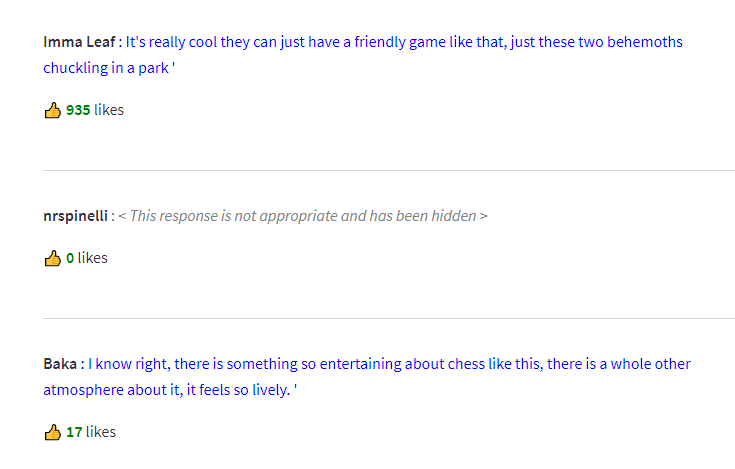

# TubeTalk

## Cohere's hackathon - January 2023

### Quick Install
Installing the aplication is done by cloning this repository and then running:

`pip install -r requirements.txt`

`pip install protobuf==3.20.1`

### 🤔 What is this?

This application is built on top of Cohere's Large Language Models and Embeddings, and uses them to easily summarize YouTube comments on videos that have hundreds or thousdands of comments.

### 📖 Documentation

How-to example: [A demo of how to interact with the application]()

### Running the application locally

##### Prerequisites

- A Cohere account and a Cohere API Key
- A Google Cloud account a Google Cloud project configured
  - Enable YouTube Data API v3 ([tutorial on how to set it up](https://developers.google.com/youtube/v3/getting-started))
    - create the API key and copy and paste it in the `apis/youtube_client.py` file, in the `DEVELOPER_KEY` variable
    - 
  - A Firebase database running in native mode with Documents and Collections ([tutorial on how to set it up](https://firebase.google.com/docs/firestore/quickstart))
  - Once you have the Firebase database (native) created you need to:
    - create a service account with which you can access the database ([tutorial on how to create a service account](https://cloud.google.com/iam/docs/creating-managing-service-accounts))
    - download the service account key as a JSON file ([tutorial on how to generate and download the key](https://cloud.google.com/iam/docs/creating-managing-service-account-keys#get-key))
- A Pinecone account and a Pinecone project configured ([tutorial on how to set it up](https://docs.pinecone.io/docs/quickstart))
  - the Pinecone project needs to have an index created, called `youtube-comments`
  - 
  - get the Pinecone API Key from the Pinecone project settings

##### Local environment setup

- install Python 3.9.8 or newer
- install the requirements for the environment mentioned above in the Quick Install
- clone this repository
  - in each of the Python modules in the **apis** package, add the corresponding KEY and SECRETS.
        
        (for cohere.py)        
            self.co = cohere.Client("< COHERE_API_KEY >")` 
        ---------------------------------------
        
        (for firestore_client.py)
            CREDENTIALS_FILE = "credentials/firestore-credentials.json"
        ---------------------------------------
        
        (for pinecone_client.py)
            # API key for Pinecone Vector DB
            API_KEY = "< PINECONE_API_KEY >"
    
            # GCP environment zone
            ENVIRONMENT = "< environment >" (ex: us-west-2 or us-east1-gcp)
        ---------------------------------------

        (for youtube_client.py)
            DEVELOPER_KEY = "< YOUTUBE_API_KEY >"    
        
- open a command terminal and run `streamlit run app.py`
- a web browser and tab should open with the application already running (please wait a few seconds at the beginning while our first API calls and processing is done)

#### Structure of the application

- app.py - is the main Python module and the entry point in the application. It contains the business logic that ties all the APIs together and code for generating the Streamlit interface. It also handles the interactions with the web-application, after any button-press, by setting certain values in the `streamlit.session_state` (which is why some of the code is so nested)

- **apis** package - contains all the code required to interact with the 3rd party API's (Cohere, Pinecone, Firestore and YouTube)

- **comment_analysis** package - contains all the code that we use to identify clusters of comments based on their embeddings and to identify the topics of the comments, based on common topic modelling techniques like LDA (Latent Dirichlet Allocation)
  - cluster_identifier.py - takes in raw comments and calculates the embeddings for them. Then based on the 
    embeddings it identifies clusters of comments that are similar to each other.
  - topic_identifier.py - takes in raw comments and identifies the topics in the comments, based on the LDA algorithm.
    It returns a dictionary of topics clusters ID's and comment ID's that belong to that cluster.

- **images** folder - contains sample images for showing in the README

#### Workflow diagram

  The following shows how the application works and how data flows through the application, in a top-down manner, from YouTube to data stores (Firestore and Pinecone) and to modeling and clustering services in the application, which generate insights about the video, which are stored in-memory during runtime.

----

### 💻👨‍💻 Demo

You can try out the application [here](http://34.70.46.172:8501/) (please use HTTP, not HTTPS, because we couldn't use HTTPS because our certificate is not recognized by our browser, because we used a static IP, not a public domain name)

#### The logical flow of the application

- Our Streamlit application is a PoC which shows the way our full-feature web application would work.

- The application starts and displays a page with a search bar, where you can search for a YouTube video by URL

  

- After you enter the URL and press the "Analyze comments" button, the application will start downloading and processing the comments on the video and will do an analysis on the comments

  

- After displaying the general statistics about the comments, the application will display an input text field, where you can interact with the comments posted on the video by asking free text questions in order to find out information about the comments.
  For example, the below image shows what comments some users have posted about the chess matches.

  

- However, since this is the Internet, sometimes people can't help themselves and post rude comments. The application will also display a list of the rude comments that have been posted on the video, so that the content creator can take action and remove them.
  
  Our application takes care of situations when it encounters a potential harmful comment automatically flags it and hides it from the search results.

  

----

### 🚀 What can this help with?

TubeTalk has been designed to be a tool that allows YouTube content creators to better understand their audience and what their audience thinks about their videos.
It's easy for the most popular YouTube channels to get hundreds or thousands of comments on their videos, and it's hard for the content creators to go through all of them and understand what their audience thinks about their videos.

- As the world turns ever more to YouTube for finding information and entertainment, the comments section is becoming more and more important for the users of the platform.
- The comments section is a place where users can interact with each other, and where they can find answers to their questions. However, the comments section is also a place where users can post spam, and where they can post comments that are not helpful to other users or even outright rude comments.

##### 📈 How can this help with the YouTube creators?
  - This tool provides content creators to better understand their audience in terms of what topics they discuss on the videos, what questions they ask about the videos, and what comments they post about the videos.
  - Sometimes likes and dislikes are not a good enough metric to gauge why people like or dislike your videos and sometimes the only solution is to dig into the comments and read them 
  - However, this is a very difficult task especially for videos that have hundreds or thousands of comments. **This tool can help** improve the understanding of the audience by summarizing all comments into topics.
  - Not only that, but if a content creator wants to go more in-depth with the comments, they can ask questions about the comments and get answers to those questions.

##### How can this help with the YouTube users? 👨‍🦱👩‍🦰👨👩
  - This tool can help YouTube users find answers to their questions. 
  - How many times have you asked in the comment section what song is being played in the video, because the creator didn't post the name of the song in the video description?
  - YouTube is also a place where spam bots are very active. This tool can help users avoid reading through tons of spam comments and just get the answers they want, by using the search functionality.
----

### 💡 Challenges and solutions 🏆

The main way we've used the API's from Cohere were focused more on the embeddings, but we've also used a few-shot approach with the Generate model and the Classify model also.

#### Embeddings
We've used the embeddings on all of our text data to build the base for our topic modeling and for our search functionality.

#### Few-shot learning with the Generate model

We've also used Few-shot learning to generate the summary sentence of comments that are part of the same cluster, so that you can get a better feel about what is a quick summary of the type of comments people post on the video.

#### Classify model
We've used the Classify model to classify the comments as either "appropriate" or "not appropriate" and then based on this classification we decide if we show them, when a user interacts with the "Search in comments" functionality.
But the model requires a lot of training data, so we've had to use a lot of data to train the model between harmful and rude comments and comments that are acceptable.

#### Finding the optimal number of clusters
We've had to do a lot of trial and error until we started calculating what would be the optimal parameter values for number of clusters and the minimum cosine distance in the cluster, so that similar comments are clustered together.

We needed to find a good ration between the number of clusters and the number of comments in each cluster, so that we can have a good number of clusters, but also have enough comments in each cluster to be able to generate a summary sentence for each cluster.

### Future improvements

1. Improving the power and accuracy of the classification model is the main thing that we would like to improve in the future. We would do this by using the [YouTube Toxicity Dataset](https://www.kaggle.com/datasets/reihanenamdari/youtube-toxicity-data) to train the model.
2. We would also like to improve the search functionality by using the embeddings of the comments to find the most similar comments to the query that the user has entered.
3. Replacing the Streamlit frontend with a React frontend, so that we can have a more interactive and better looking frontend.
4. Build more metrics and visualizations for the content creators to better understand their audience.

### 3rd party API's used

- [Cohere](https://cohere.ai/) - Cohere is a natural language processing API that provides a set of tools for text processing, including embeddings, topic modeling, and text classification.
- [Firestore](https://firebase.google.com/docs/firestore) - Firestore is a NoSQL database that we used to store the comments that we've downloaded from YouTube.
- [Pinecone](https://www.pinecone.io/) - Pinecone is a vector database that we used to store the embeddings of the comments that we've downloaded from YouTube.
- [YouTube Data API](https://developers.google.com/youtube/v3) - YouTube Data API is a REST API that we used to download the comments from YouTube.

#### FAQ

- Why did you also use Pinecone and Firestore?
  - We used Pinecone to store only the embeddings of the comments that we've downloaded from YouTube, so that we can use them for the search functionality.
  - We used Firestore to store the comments that we've downloaded from YouTube, so that we can use them for the search functionality and reduce the costs of the application by storing comment information in Firestore.

- How did you do topic modeling?
  - We used the embeddings that we've downloaded from Cohere to do topic modeling. We used the embeddings to build a vector database with Pinecone and then we used the vector database to do topic modeling with Cohere.

# License

© All rights are reserved and this repository is **NOT** Open Source or Free. You cannot modify or redistribute this code without explicit permission from the copyright holder.
